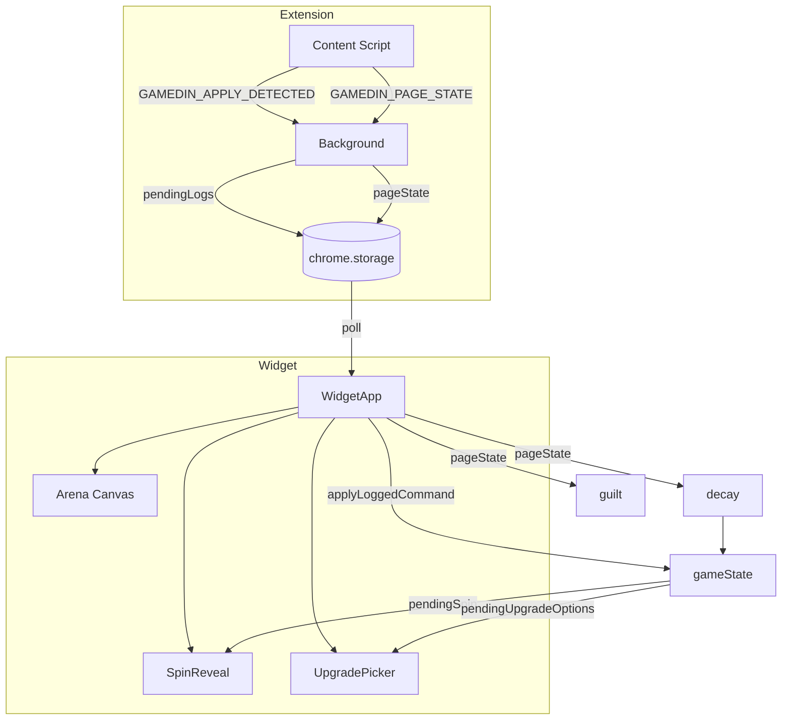

# GamedIn Full Game Implementation

## Stack and AI Vibecoding

- **Stack:** TypeScript (strict), React, Vite, Zod, Vitest, Playwright, raw Canvas. All maximize AI assistance.
- **Domain:** Pure TS modules (`spin.ts`, `upgrades.ts`, `guilt.ts`, `achievements.ts`) — no React, no side effects.
- **State:** Command pattern (`applyLoggedCommand`, `confirmSpin`, `selectUpgrade`) — explicit inputs/outputs.
- **Arena:** Split render vs simulation. `domain/arena-sim.ts` = pure sim (spawn, move, hit detection). `game/Arena.tsx` = RAF loop + draw.
- **JSDoc:** Add to all exported domain/state functions for AI context.
- **Avoid:** Redux, Phaser/heavy engines. Use Context7 for library docs when adding/changing usage.

See [.cursor/rules/gamedin-core.mdc](../.cursor/rules/gamedin-core.mdc) for full AI-first rules.

---

## Current State vs Target

**Keep:** Extension (apply detection, activity, page state), widget iframe, storage adapter, job linking framework, PageDataPanel.

**Scrap:** Phaser Arena, entities/debris/orbs, old reward/progression/arena domain logic, `units`, `upgrades` (old shop).

**Add:** New SaveState schema, Cope Pet, passive VS arena (Canvas), Spin (gacha), Upgrade (pick 1 of 3), decay, guilt triggers, meta (achievements), theming.

---

## Phase 1: Domain Types and Game State

### 1.1 New types ([web/src/domain/types.ts](web/src/domain/types.ts))

Replace old types with:

```ts
// Core
export type SpinOutcome = 'ghosted' | 'rejected' | 'interview' | 'offer'  // rarity: common → rare
export type EnemyType = 'ghosted' | 'rejection' | 'fake_job' | 'ats_filter' | 'rent_due' | 'despair'
export type WeaponId = string  // e.g. 'easy_apply' | 'tailored_resume' | ...
export type UpgradeId = string  // weapon, passive, or stat

// Cope Pet
export interface CopePet {
  id: string
  mood: number       // 0-100, decays when idle
  lastFedAt: string  // ISO, last apply time
}

// Arena (passive VS)
export interface ArenaEnemy {
  id: string
  type: EnemyType
  x: number
  hp: number
}
export interface ArenaWeapon {
  id: string
  weaponId: WeaponId
  x: number
  lastFiredAt: number
}
export interface ArenaState {
  pet: CopePet
  enemies: ArenaEnemy[]
  weapons: ArenaWeapon[]
}

// Run (daily)
export interface RunState {
  appliesToday: number
  dayKey: string     // YYYY-MM-DD
  completed: boolean // hit daily goal
}

// Spin
export interface SpinResult {
  outcome: SpinOutcome
  hopiumAwarded: number
  timestamp: string
}

// Upgrade choice
export interface UpgradeOption {
  id: UpgradeId
  label: string
  type: 'weapon' | 'passive' | 'stat'
}

// Meta
export interface MetaState {
  achievements: string[]
  collectibles: string[]
  totalRunsCompleted: number
}

// SaveState (new)
export interface SaveState {
  profile: Profile
  applications: ApplicationLog[]
  economy: { hopium: number; totalHopiumEarned: number }
  engagement: { streakDays: number; lastApplyDate: string | null }
  run: RunState
  arena: ArenaState
  meta: MetaState
  telemetryQueue: TelemetryEvent[]
  // Pending UI state
  pendingSpin: SpinResult | null
  pendingUpgradeOptions: UpgradeOption[] | null
}
```

Remove: `ArenaEntity`, `ArenaDebris`, `ArenaOrb`, `EntityVariant`, `UnitState`, `UpgradeState`, `ProgressionState` (fold into run/meta).

### 1.2 Game state ([web/src/state/gameState.ts](web/src/state/gameState.ts))

- `createInitialState()`: New schema, single Cope Pet, empty arena.
- `applyLoggedCommand(state, input, pageState?)`: 
  1. Add application
  2. Update streak (reuse existing streak logic)
  3. Run spin (gacha), store result in `pendingSpin`
  4. Generate 3 upgrade options, store in `pendingUpgradeOptions`
  5. Award Hopium from spin
  6. Update pet mood, lastFedAt
  7. Add weapon or apply upgrade based on later choice
- `confirmSpin(state)`: Clear pendingSpin.
- `selectUpgrade(state, optionId)`: Apply chosen upgrade, clear pendingUpgradeOptions.
- `tickDecay(state, pageState, now)`: If `!pageState?.tabVisible`, decay Hopium and pet mood over time.
- `checkDailyReset(state, now)`: If new day, reset run, persist meta.
- Remove: `purchaseUpgrade`, `interactEntity`, `boostEntity`, `clearDebris`, `collectOrb`, `tickArenaOrbs`, `updateEntityPosition`.

### 1.3 Spin logic (new [web/src/domain/spin.ts](web/src/domain/spin.ts))

- `runSpin(pageState?: PageState): SpinResult` — RNG for outcome (Ghosted 60%, Rejected 25%, Interview 12%, Offer 3%). If `timeOnDetailSec >= 60` or `lastCardHoverDurationSec >= 20`, slight boost to rare odds.
- Hopium amounts per outcome (e.g. Ghosted: 5, Rejected: 12, Interview: 25, Offer: 50).

### 1.4 Upgrade pool (new [web/src/domain/upgrades.ts](web/src/domain/upgrades.ts))

- Pool of upgrades: weapons (Easy Apply, Tailored Resume, Cover Letter), passives (Respect Aura, Copium Shield), stats (+10% Hopium).
- `getRandomUpgradeOptions(count: 3): UpgradeOption[]` — Pick 3 unique from pool.

---

## Phase 2: Arena (Passive Vampire Survivors)

### 2.1 Remove Phaser

- Delete [web/src/game/ArenaScene.ts](web/src/game/ArenaScene.ts)
- Remove `phaser` from [web/package.json](web/package.json)
- Delete [web/src/domain/arena.ts](web/src/domain/arena.ts)

### 2.2 New Canvas Arena ([web/src/game/Arena.tsx](web/src/game/Arena.tsx))

- Replace Phaser with `<canvas>` + `requestAnimationFrame`.
- **Rendering:** Pet (simple shape/emoji) center-bottom; enemies drift in from sides; weapons auto-fire projectiles.
- **Simulation:** 
  - Enemies spawn over time (rate scales with idle time / inverse of mood).
  - Weapons fire at interval; projectiles hit enemies.
  - Pet takes damage when enemies reach it; mood affects effective HP.
  - No user input (no click handlers for pet/enemies).
- **State sync:** `state.arena` drives render; `tickDecay` and apply flow update arena.
- Height ~140px, full width. Dark green/black 8chan aesthetic.

### 2.3 Arena tick logic ([web/src/domain/arena-sim.ts](web/src/domain/arena-sim.ts) new)

- **Pure sim:** `tickArena(state, dtMs, pageState): ArenaState` — Spawn enemies, move projectiles, resolve hits, update pet mood from damage. No side effects.
- **Render:** `game/Arena.tsx` RAF loop calls `tickArena`, passes result to `setState` to persist. Draws from `state.arena`.

---

## Phase 3: Apply Flow — Spin + Upgrade UI

### 3.1 Apply flow in WidgetApp

When `applyLoggedCommand` returns:

1. State has `pendingSpin` and `pendingUpgradeOptions`.
2. Show **Spin modal/overlay**: reveal gacha result (card flip or slot-style), display Hopium awarded.
3. On "Continue" → `confirmSpin`.
4. Show **Upgrade modal**: 3 buttons "Pick 1 of 3". On click → `selectUpgrade`, close modal.

### 3.2 Spin component ([web/src/game/SpinReveal.tsx](web/src/game/SpinReveal.tsx))

- Props: `result: SpinResult`, `onConfirm: () => void`
- Visual: Outcome label (Ghosted/Rejected/Interview/Offer), Hopium amount. Sarcastic copy per outcome.
- Button: "Cope" / "Continue" → onConfirm.

### 3.3 Upgrade picker ([web/src/game/UpgradePicker.tsx](web/src/game/UpgradePicker.tsx))

- Props: `options: UpgradeOption[]`, `onSelect: (id) => void`
- 3 cards/buttons. Click one → onSelect, apply upgrade to state.

---

## Phase 4: Decay and Guilt Triggers

### 4.1 Decay ([web/src/state/decay.ts](web/src/state/decay.ts) or in gameState)

- `tickDecay(state, pageState, now)`: 
  - If `pageState?.tabVisible === true` on job site: pause decay.
  - Else: decay Hopium (e.g. -1 per 5 min), decay pet mood (e.g. -2 per 5 min).
- Call from WidgetApp `useEffect` with `setInterval` (e.g. every 60s), pass latest `pageState` from storage.

### 4.2 Guilt triggers ([web/src/domain/guilt.ts](web/src/domain/guilt.ts))

- `getGuiltMessage(pageState, lastApplyAt): string | null`
- Rules from Project Guidelines:
  - Cards scrolled past ≥ 10 → "10 cards passed. Apply to one?"
  - Hover duration ≥ 30s → "You've been looking at this. Apply?"
  - Apply button in view → "Apply button visible. One click away."
  - Scroll depth ≥ 80% → "80% scrolled. Apply before you leave."
  - Total time on details ≥ 5 min → "X min on details. Apply to one?"
- Debounce: show at most one message per 2 min, rotate if multiple conditions.
- WidgetApp: when `pageState` updates and no pending apply, call `getGuiltMessage` and set `message` state.

---

## Phase 5: Meta (Achievements and Collectibles)

### 5.1 Achievements ([web/src/domain/achievements.ts](web/src/domain/achievements.ts))

- List: e.g. `first_apply`, `streak_7`, `run_complete`, `100_applications`, `spin_offer`.
- `checkAchievements(state): string[]` — returns newly unlocked IDs.
- On apply/run complete: merge into `state.meta.achievements`.

### 5.2 Collectibles

- Simple: pet skins or titles. Unlock via achievements.
- Store in `meta.collectibles`. Optional: small UI in Stats to show unlocked.

---

## Phase 6: Theming and UI Copy

### 6.1 Terminology updates

Per earlier design doc, replace labels:


| Old       | New                                |
| --------- | ---------------------------------- |
| Profile   | Hopium Config                      |
| Shop      | Pay-to-Cope (or remove if no shop) |
| Stats     | Rejection Ledger                   |
| Pts       | Hopium                             |
| Entities  | (remove)                           |
| Today X/Y | X/Y daily hopium dose              |


### 6.2 Message copy

- "Application logged! Rewards granted." → "Application logged. +X Hopium. They probably won't reply."
- "Profile saved." → "Delusion saved."
- "Not enough points." → "Not enough suffering yet."
- Loading → "Loading your despair…"

### 6.3 WidgetApp and App.tsx

- Update all labels, messages, tab names.
- Stats bar: Hopium, Streak, Run (X/Y), remove Entities.
- Profile form: "Daily Hopium Dose", "Commit to Delusion", etc.
- Shop tab: Remove or repurpose (e.g. "Pay-to-Cope" with meta unlocks).

---

## Phase 7: Storage and Validation

### 7.1 Storage ([web/src/widget/storage.ts](web/src/widget/storage.ts))

- Update `isSaveState` to validate new schema (hopium, arena.pet, run, meta).
- `restoreState`: Invalid/old data → `createInitialState()`.
- Key remains `gamedin.save` (no version suffix).

### 7.2 Validation ([web/src/domain/validation.ts](web/src/domain/validation.ts))

- Update `profileSchema` if needed.
- Ensure `applicationInputSchema` still works for apply payload.

---

## Phase 8: Cleanup and Tests

### 8.1 Remove dead code

- [web/src/domain/reward.ts](web/src/domain/reward.ts) — delete or replace with spin logic.
- [web/src/domain/progression.ts](web/src/domain/progression.ts) — delete (folded into run/meta).
- [web/src/game/StatsPanel.tsx](web/src/game/StatsPanel.tsx) — update for new stats (remove Entities, add Run).
- [web/src/dev/DevPanel.tsx](web/src/dev/DevPanel.tsx) — update fixtures for new state.
- [web/src/dev/fixtures.ts](web/src/dev/fixtures.ts) — `generateTestApplication` stays; `generateTestApplications` adapt for new state.
- [web/src/state/gameState.test.ts](web/src/state/gameState.test.ts) — rewrite for new commands.

### 8.2 App.tsx

- Mirror WidgetApp changes: new state shape, Arena, Spin, Upgrade, decay, guilt, theming.
- Ensure `loadState`/`saveState` from [web/src/state/saveSync.ts](web/src/state/saveSync.ts) uses same schema.

### 8.3 E2E and unit tests

- Update smoke test if it asserts on old DOM/structure.
- Fix any broken imports.

---

## Data Flow Diagram




---

## File Change Summary


| Action      | Files                                                                                                                                                                         |
| ----------- | ----------------------------------------------------------------------------------------------------------------------------------------------------------------------------- |
| **Rewrite** | `domain/types.ts`, `state/gameState.ts`, `game/Arena.tsx`, `widget/WidgetApp.tsx`, `App.tsx`, `widget/storage.ts`                                                             |
| **Create**  | `domain/spin.ts`, `domain/upgrades.ts`, `domain/guilt.ts`, `domain/achievements.ts`, `domain/arena-sim.ts`, `game/SpinReveal.tsx`, `game/UpgradePicker.tsx`, `state/decay.ts` |
| **Delete**  | `game/ArenaScene.ts`, `domain/arena.ts` (old), `domain/reward.ts`, `domain/progression.ts`                                                                                    |
| **Update**  | `game/StatsPanel.tsx`, `dev/DevPanel.tsx`, `dev/fixtures.ts`, `domain/validation.ts`, `state/saveSync.ts`, `package.json`                                                     |


---

## Implementation Order

1. **Phase 1** — Types + gameState (applyLoggedCommand with spin/upgrade stubs)
2. **Phase 7** — Storage/validation (so new state persists)
3. **Phase 3** — Spin + Upgrade UI (modal flow)
4. **Phase 2** — Canvas Arena (replace Phaser)
5. **Phase 4** — Decay + guilt
6. **Phase 5** — Meta (achievements)
7. **Phase 6** — Theming
8. **Phase 8** — Cleanup, tests

